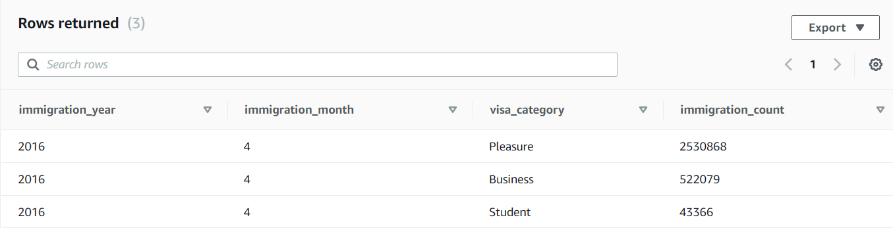

# Project Title

### Data Engineering Capstone Project

#### Rama Iyer

#### Project Summary

This project is my capstone submission for the Udacity Data Engineering Nanodegree. It showcases what I've learned through the program by taking large sets of data and organizing it in such a way that allows others to gain valuable insight from it.

This project creates an analytical datawarehouse for consumption by US Government, which can be used to understand immigration patterns, and help in making policy decisions around immigration so that industries such as tourism, business and higher education sector are able to thrive successfully. 

The analytical warehouse is hosted on Amazon Redshift and the pipeline implementation was done using Apache Airflow.

The project follows the follow steps:
* Step 1: Scope the Project and Gather Data
* Step 2: Explore and Assess the Data
* Step 3: Define the Data Model
* Step 4: Create the Data Model
* Step 5: Further Questions
* Step 6: Some Analytics by querying the data model 

### Step 1: Scope the Project and Gather Data
#### Scope
In this project an analytical database will be made available for the USA government, so they can quickly gather insights from the data.

At a high level,  
The data is cleaned and loaded into S3 as parquet files using Spark. 
This is then loaded into Redshift using pipeline created using Airflow.

#### Describe and Gather Data 
Data Sets Used:  
The following data was used to build the datawarehouse:  

I94 Immigration Data:  
The immigration data comes from the [US National Tourism and Trade Office](https://www.trade.gov/national-travel-and-tourism-office). It includes information about people entering the United States, such as immigration year and month, arrival and departure dates, age and year of birth of immigrant, arrival city, port, current residence state, travel mode (air, sea), visa type etc. Specificially, the data from April 2016 is used to showcase this project, which is over 1 million records. The data is in parquet format.    

U.S. City Demographic Data:  
The demographic data comes from [OpenSoft](https://public.opendatasoft.com/explore/dataset/us-cities-demographics/export/). It includes demographic information about US cities, such as the median age, total population, and specific populations (male vs female, foreign-born, different races, etc.). The data is in csv format.  

Country Data  
This data was provided in [I94_SAS_Labels_Descriptions.SAS](data/I94_SAS_Labels_Descriptions.SAS) in the provided project and contains a mapping of country names and their I94 codes that are found in the immigration data. I used Spark to create a parquet file with this information.  

Visa Codes  
This data was provided in [I94_SAS_Labels_Descriptions.SAS](data/I94_SAS_Labels_Descriptions.SAS) in the provided project. This maps to the I94VISA column in the immigration table. I used Spark to create a parquet file with this information.  

State Code  
This data was provided in [I94_SAS_Labels_Descriptions.SAS](data/I94_SAS_Labels_Descriptions.SAS) in the provided project. This maps to the I94ADDR column in the immigration table. I used Spark to create a parquet file with this information.  

Travel Mode  
This data was provided in [I94_SAS_Labels_Descriptions.SAS](data/I94_SAS_Labels_Descriptions.SAS) in the provided project. This maps to the I94MODE column in the immigration table. I used Spark to create a parquet file with this information.  

Port Code    
This data was provided in [I94_SAS_Labels_Descriptions.SAS](data/I94_SAS_Labels_Descriptions.SAS) in the provided project. This maps to the I94PORT column in the immigration table. I used Spark to create a parquet file with this information.  

Airport Code Table: This is a simple table of airport codes and corresponding cities. It comes from [here](https://datahub.io/core/airport-codes#data).  

### Step 2: Explore and Assess the Data
#### Explore the Data 
Immigration data, City Demographics and Airport data were the data sets that needed cleaning up. I explored the datsets using Spark in Jupyter notebook.  
Some findings based on this  

**City Demographics Data**
* Total number of records was 2891 whereas distinct count of cities was only 567
* Only 5 distinct Race in the entire dataset

**Immigration Data**
* Total number of records is 3096313 and the number of distinct immigration_id's (cicid) was also 3096313 which suggests that the column cicid is unique.
* The data spans arrival dates in the month of April for the year 2016
* The dates provided are SAS dates
* The arrival date is populated for all records
* Some of the records have departure dates that is before the arrival date

**Airport Data**
* Total number of records is 55075 however only 9189 records have the iata code populated
* There are 279 closed airports
* Number of airports appear more than once in the data set
* Latitude and longitude are in a single column separated by commas  

**Global Temperature Data**
* More than 8 million records in the dataset
* The date on this goes back to the 18th century
* For cities in the United States, the first available date is from the 18th century
* For the cities in the US, temperature data is available upto 1st September 2013.

#### Clean the Data   
I created a python module called etl.py to clean up the data and import the cleaned data to an S3 bucket as parquet files using Spark. I decided to use Spark because it can easily handle large amounts of data. S3 was chosen as a storage solution because it is easily accessible by other useful AWS products.

*Immigration Data*  
When uploading to S3, I partitioned the immigration data by immigration year and month because this value is never null and provides a fairly even distribution of the data for future pipeline steps.  

The python script etl.py reads the data file, performs the below cleaning steps and writes to partioned parquet files on S3.
* Convert the columns to their appropriate data types (integer, dates)
* Rename the columns to friendy names that can be understood by the users
* Remove immigration data where the departure date is prior to the arrival date
* Retain only columns needed for analysis 
* Convert the dates to the format yyyy-mm-dd
* Duplicate the immigration year and month columns so that the data could be partitioned by immigration year and month and still be included in the data files
* Write the data to an S3 bucket as parquet files partitioned by immigration year and month

*Date Data*  
* From the cleaned immigration data frame, I extracted the unique arrival and departure dates and created a dataframe with unique dates.  
* The dataframe was further enriched with other date columns like year, month, day, day_of_week that will be useful for analysis.  
* I also created date_id which was integer data type in the format yyyymmdd for use in the fact tables.  
* This data was then written to the S3 bucket as parquet files.   

*City Demographics Data*
* Convert the columns to appropriate data types (integer,float)
* Pivot the data set on Race for each city and state combination and joined the results back to get a single row of race counts per city per state. This will be useful in understanding immigration patterns in various states.
* As the number of unique cities was only 567, data was not partitoned when written to parquet files on S3.  

*Airports Data*
* Chose the appropriate data types for the columns
* Filtered the data to exclude all closed airports and airports that did not have any iata code or had a zero value for iata code. This was done because this is the code that will be used to join to the immigration data.
* Remove duplicates based on iata_code and type so that the resulting data frame has distinct list of airports
* Use an UDF to split the column coordinates to get the individual values for latitude and longitude  

*Mapping Visa Codes, Travel Mode Codes, Port Codes, Country Code and State Code*
* dataMappings.py contains the dictionary of values for visa, travel mode, port codes, country and state code taken from the I94_SAS_Labels_Description file
* As these were already cleaned data, I created spark dataframes for each of these and wrote to parquet files on S3.

*Global Temperature Data*
* Convert columns to the appropriate data type (date, float)
* Filter the data by cities in US only as the main immigration data is data for the US only
* Also select only temperature date between 2000 and 2013 because the immigration data given is for the year 2016 only.
* Average temperature per month per city per state 
* Spark was used to carry out the above steps and write to parquet files in S3.

### Step 3: Define the Data Model
#### 3.1 Conceptual Data Model
I used a star schema for the data model. My intention is to keep the queries as simple as possible by not making the tables too normalized and limiting the required number of joins. An ER diagram of this data model can be found [here](documents/DataModel.pdf)  

At the center of the data model is a fact table focusing on immigration (fact_immigration), the majority of which can be found in the immigration data. The dimensions provide additonal information to support the immigration data (dim_date, dim_country, dim_state, dim_city, dim_visa, dim_travel_mode, dim_ports). 

#### 3.2 Mapping Out Data Pipelines
1. etl.py - This python script was run to transform the various data files (immigration, airports, ports, demographics) into various parquet files that are stored in S3 bucket.  
2. The data model is on AWS Redshift. I chose Redshift due to its efficiency in handling large amounts of data. 
The files in S3 are first staged and then loaded into the various dimensions and facts.  
3. I chose Apache Airflow to complete this data pipeline because of its ease of use, has ready-to-use operators that can be used to integrate Airflow with S3 and Redshift. It's graphical UI can be used to monitor and manage work flows. It is easy to check the status of tasks and to schedule the tasks.

### Step 4: Create the data model
#### 4.1 Run Pipelines to Model the Data 
Build the data pipelines to create the data model.  

Prerequisite: Redshift cluster created in Oregon region as S3 files are stored in Oregon region. Modify the accessibility settings of the cluster so that it is accessible from the internet. 

Once this is done, the following steps are executed.

1. To create the required staging, dimension and fact tables in Redshift, execute the capstone_tablecreation_dag in the Airflow Web UI. This drops and creates all the tables required by the data model

2. Next, execute the capstone_dag in the Airflow UI. This takes care of populating the staging tables from S3, transforms the data and loads to dimension tables and fact table. The data quality checks are also taken care of here.  

The data pipeline in Airflow consists of the below operators:  
*StageToRedshiftOperator*    
This operator takes a  parquet file and copies it directly into a Redshift table. All the staging tables below are loaded in parallel.  

staging_visa  
staging_travel_mode  
staging_country  
staging_ports  
staging_climate  
staging_city  
staging_state  
staging_date  
staging_immigration    

*LoadDimensionOperator*  
This operator queries the staging tables and populates the dimension tables. It provides an optional parameter called columns that allows the user to specify the fields in which to enter data rather than assuming every field is being populated. There is a helper file that contains all the queries referenced in this operator. The following tables are populated using this.    

dim_visa  
dim_travel_mode  
dim_country  
dim_ports  
dim_state  
dim_city  
dim_date  

*LoadFactOperator*  
This operator is used to populate the fact table fact_immigration. There is a helper file that contains all the queries referenced in this operator.   

#### 4.2 Data Quality Checks
Explain the data quality checks you'll perform to ensure the pipeline ran as expected. These could include:
 * Integrity constraints on the relational database (e.g., unique key, data type, etc.)
 * Unit tests for the scripts to ensure they are doing the right thing
 * Source/Count checks to ensure completeness
 
Run Quality Checks  
*DataQualityOperator*    
This takes in as a parameter an array of tables to run the quality checks.
This operator checks that the table atleast has a certain number of records. 
    

#### 4.3 Data dictionary 
The data dictionary for the final data model can be found [here](documents/DataDictionary.md)  

### Step 5: Further Questions
* *Rationale for the choice of tools and technologies for the project*  
Used spark to transform the data into parquet files that are stored in S3. Spark is a powerful analytical engine for big data and hence used this.   
S3 facilitates highly-scalable, secured and low-latency data storage from the cloud. With its simple web service interface, it is easy to store and retrieve data on Amazon S3 from anywhere on the web.  
Redshift is cloud based and hosted directly on Amazon Web Services and has a flexible architecture that can scale in seconds to meet changing storage needs. Costs can be kept relatively low and it is easy to use.   
Airflow is used to automatically organise, execute, and monitor data flow. Hene, used airflow for executing the data pipeline    

* *How often the data should be updated*  
The I94 immigration data is updated on a monthly basis and hence it is feasible to say, data processing and ETL can be done on a monthly basis.

* *Different approaches to the problem under the following scenarios:*  
 * *The data was increased by 100x.*      
 For the existing project, the Spark and Airflow processes are run in the Udacity workspace. If the data was increased by 100x, I would run these processes on a more powerful environment in AWS, such as Amazon Elastic MapReduce (EMR) for Spark and Amazon Managed Workflows for Apache Airflow (MWAA) for Airflow.  
 * *The data populates a dashboard that must be updated on a daily basis by 7am every day.*    
 Schedule the dag to run every morning and set a SLA so that it completes in a reasonable amount of time.    
 * *The database needed to be accessed by 100+ people.*  
 Amazon Redshift data sharing lets us share live data in Amazon Redshift to securely and easily share data for read purposes with other Redshift clusters within and across AWS accounts and with AWS analytic services using the data lake. With data sharing, users can instantly query live data from any Redshift cluster as long as they have permissions to access without the complexity and delays associated with data copies and data movement. This feature can be used if the database has to be accessed by 100+ people.  
 
### Step 6: Some Analytics by querying the data model
* *Query 1 - Top 5 countries from where immigrants arrive*
  
  

* *Query 2 - Most Popular visa categories*
  
  
  
* *Query 3 - Top 5 states chosen as destination to immigrate*
  
  

* *Query 4 - Immigration count by gender of immigrant*
  
  